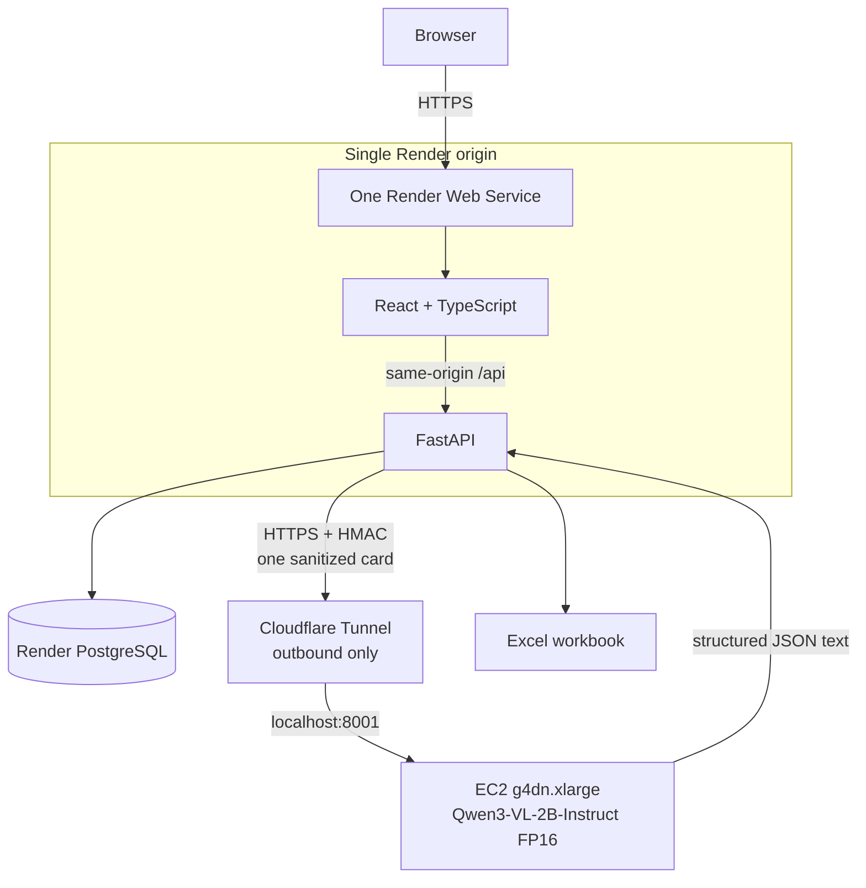

# O-HIVE Business Card Leads

A focused document-intelligence workspace for bulk business-card ingestion. Users can validate and upload multiple JPG, PNG, or WEBP cards, watch real per-card progress, review or correct extracted leads, remove unwanted records, and download a genuine seven-column Excel workbook.

## Assignment status

The implementation and local verification are complete. External services that still require account access are reported as pending, not simulated:

| Deliverable | Status |
| --- | --- |
| Public application URL | **Pending** — no Render account/API credential is available in this environment |
| Public GitHub repository | [github.com/Ansh701/o-hive-vlm-business-card](https://github.com/Ansh701/o-hive-vlm-business-card) |
| AWS Qwen inference | Deployment path complete; real provisioning/acceptance is **pending AWS credentials and GPU quota** |
| Local application/tests | Verified; see [Verification](#verification) |

Expected production URL after deployment: `https://o-hive-vlm-business-card.onrender.com/`.

No fallback model provider is used. Until the AWS endpoint is provisioned, extraction correctly returns a configuration error rather than silently calling OpenAI, Hugging Face Inference, Alibaba, or another hosted model.

## Assignment overview

The application implements the required seven fields:

1. First Name
2. Last Name
3. Position / Job Title
4. Company
5. Location
6. Phone Number
7. Email Address

The app opens directly into the upload workflow—there is no marketing landing page. Its three visible stages are Upload, Review, and Export. The interface defaults to light mode, includes a designed dark mode, persists the preference locally, and recovers the last completed batch after refresh using only a capability-style batch UUID in local storage.

## Architecture



The browser never receives AWS credentials or the inference secret. The EC2 security group has no inbound rules. `cloudflared` establishes an outbound HTTPS tunnel to the localhost-only model service, avoiding a load balancer, NAT gateway, Elastic IP, and public model port.

## Technology stack

| Layer | Components |
| --- | --- |
| Frontend | React 19, TypeScript, Vite, Lucide, plain responsive CSS |
| Application API | Python 3.12+, FastAPI, Pydantic Settings, httpx |
| Persistence | PostgreSQL, SQLAlchemy 2 async, asyncpg, Alembic |
| Image safety | Pillow with decode/verify/re-encode and decompression-bomb handling |
| Model runtime | Qwen3-VL-2B-Instruct, Transformers 5.10+, PyTorch 2.14, CUDA 12.6 |
| Export | openpyxl |
| Testing | pytest, Vitest, Testing Library, Playwright Core, Axe |
| Deployment | One multistage Render Dockerfile; one AWS EC2 model host; CloudFormation |

### Repository tree

```text
.
├── backend/
│   ├── alembic/versions/0001_initial.py
│   ├── app/                 # API, persistence, validation, inference client, export
│   └── tests/               # backend, security, deployment, and evaluation tests
├── evaluation/
│   ├── cards/               # nine fictional synthetic cards
│   └── ground-truth.json
├── frontend/
│   ├── scripts/visual-qa.mjs
│   └── src/                 # React workspace, API client, styles, tests
├── inference/               # AWS-only Qwen service and HMAC verifier
├── infra/aws/               # EC2, budget, and CloudFormation Guard policies
├── scripts/                 # generation, evaluation, benchmark, smoke, cost tools
├── Dockerfile               # one Render web service
├── docker-compose.yml       # local PostgreSQL + app
├── render.yaml
└── .github/workflows/       # CI and inference-image publication
```

## Major technical decisions

### Why FastAPI

FastAPI is **not** used merely because this is an AI project. It fits an I/O-heavy workflow that needs multipart image APIs, asynchronous model calls, typed Pydantic contracts, predictable error responses, and streamed binary downloads without a large framework surface.

### Why PostgreSQL

PostgreSQL is an engineering choice, not an official assignment requirement. It preserves batch state, per-card outcomes, corrections, warnings, content hashes, timestamps, and exportable leads across Render process restarts. The schema deliberately contains only two tables:

- `batches`: UUID, status, card counters, creation/completion timestamps.
- `leads`: batch relation, safe source display name, SHA-256, seven nullable fields, status, warnings, error, and timestamps.

Raw image bytes and full model responses are never stored in PostgreSQL.

### Why no queue, Redis, or microservices

Each upload request processes one card. The React client starts at most two requests concurrently, the Render inference client has a second server-side semaphore, and the AWS model runtime serializes GPU generation. This keeps failures isolated and progress real without Celery, Redis, or another operational subsystem. The trade-off is that an in-flight card request is not durable across a Render restart.

### Why an outbound tunnel

A public HTTPS model origin is needed by Render, but an Application Load Balancer would add a fixed hourly charge. A remotely managed Cloudflare Tunnel provides TLS and routes to `127.0.0.1:8001` while EC2 retains zero inbound security-group rules. HMAC still authenticates every inference body; the tunnel is transport, not the authorization boundary.

## Qwen model choice

The selected model is [`Qwen/Qwen3-VL-2B-Instruct`](https://huggingface.co/Qwen/Qwen3-VL-2B-Instruct), an Apache-2.0, approximately two-billion-parameter vision-language model with official Transformers support and OCR/document capabilities.

| Property | Choice |
| --- | --- |
| Model | `Qwen/Qwen3-VL-2B-Instruct` |
| Weight precision | FP16 |
| Quantization | None; this build does not claim unmeasured 4-bit/8-bit quality |
| Planned hardware | `g4dn.xlarge`: 4 vCPU, 16 GiB RAM, one 16 GB NVIDIA T4 |
| Runtime image | Digest-pinned `pytorch/pytorch:2.14.0-cuda12.6-cudnn9-runtime` |

FP16 is deliberate: NVIDIA T4 does not have native BF16 acceleration. Roughly 4 GB is needed for 2B FP16 weights before vision activations, KV cache, framework overhead, and the processor. The 2B model is smaller than the initially considered Qwen2.5-VL-3B and is adequate to test the seven-field extraction task without selecting a 7B+ model by default.

## AWS deployment decision

The options were evaluated in the required order:

| Option | Decision | Evidence/trade-off |
| --- | --- | --- |
| Free/credit CPU | Rejected for the submitted deployment | Free shapes do not provide enough memory for model + runtime, and CPU latency is not credible for an interactive multi-card demo. A measured AWS CPU benchmark is still pending credentials and is not fabricated. |
| Small accelerated EC2 | **Selected** | `g4dn.xlarge` is the smallest practical T4 shape: one 16 GB GPU, 16 GiB host RAM. Spot is the cost-first mode; On-Demand is the reliable review-window mode. |
| SageMaker managed inference | Rejected | [SageMaker Serverless Inference does not support GPUs](https://docs.aws.amazon.com/sagemaker/latest/dg/model-deploy-feature-matrix.html); a persistent real-time GPU endpoint adds more lifecycle complexity without lowering this demo's cost. |

The AWS model is a real service in `inference/`, not a proxy to another inference provider. The CloudFormation template creates one replaceable GPU instance, an instance profile, and an egress-only security group. It does not create a NAT gateway, load balancer, Elastic IP, RDS database, or S3 retention bucket.

## AWS cost strategy

AWS does not describe GPU instances as universally free tier. New accounts may receive credits under the [current AWS Free Tier program](https://aws.amazon.com/free/free-tier-faqs/), but eligibility is account-specific and must be checked before launch.

The current AWS bulk price feed lists Linux `g4dn.xlarge` in us-east-1 at **$0.526/hour**, effective 2026-09-01. The estimate also uses [public IPv4 at $0.005/hour](https://aws.amazon.com/blogs/aws/new-aws-public-ipv4-address-charge-public-ip-insights/) and [gp3 at $0.08/GB-month](https://aws.amazon.com/ebs/pricing/). Calculations are performed by `scripts/calculate_aws_cost.py`, not mental arithmetic:

| On-Demand lifetime | Estimated total* |
| --- | ---: |
| 1 hour | $0.5354 |
| 8-hour review window | $4.2831 |
| 24 hours | $12.8492 |
| 730-hour month | $390.8300 |

\*Compute + one public IPv4 + prorated 40 GB gp3, excluding tax and data transfer.

Spot pricing changes by Availability Zone. Query it immediately before deployment instead of copying a stale number:

```bash
aws ec2 describe-spot-price-history \
  --region us-east-1 \
  --instance-types g4dn.xlarge \
  --product-descriptions Linux/UNIX \
  --start-time "$(date -u +%Y-%m-%dT%H:%M:%SZ)" \
  --max-items 6
```

Cost guardrails:

- Spot by default; On-Demand only for a reliability-critical review window.
- One instance only, 40 GB encrypted gp3, no detailed monitoring.
- No NAT gateway, load balancer, Elastic IP, or AWS database.
- Actual 50/80/100% and forecast 100% budget alerts.
- `MAX_DAILY_CARDS`, per-address/global throttles, upload limits, and concurrency limits.
- Delete the inference stack after review; stopping leaves EBS charges, while deleting removes the volume.

## Bulk upload and extraction pipeline

1. React validates extension, browser MIME, 8 MB size, and the 20-card UI limit immediately.
2. The browser creates one batch and uploads cards independently with two workers.
3. FastAPI checks the declared request size and reads at most `MAX_FILE_BYTES + 1`.
4. Pillow verifies decoded JPEG/PNG/WEBP content, rejects decompression bombs and excessive dimensions, and re-encodes the image to drop metadata/trailing payloads.
5. SHA-256 detects duplicates inside the batch; the duplicate never triggers paid inference.
6. The sanitized card and strict extraction instruction are signed and sent to AWS.
7. JSON is parsed, validated by `BusinessCardLead`, and normalized. One repair/retry is allowed—never an unbounded loop.
8. The structured result or isolated failure is persisted; the raw image is not.
9. The user edits/selects/removes leads and requests an Excel workbook.

Missing values remain `null`. The prompt explicitly forbids inferring a surname, location, job title, company from an email domain, or country from a phone number, and tells the model to ignore instructions printed on the card.

## Normalization

- Email whitespace is collapsed and the domain is lowercased. Invalid-but-visible output is preserved with a review warning rather than silently repaired.
- International phone numbers beginning with `+` are normalized to E.164 when reliably parseable.
- National-looking phone numbers preserve source formatting and receive a country-ambiguity warning.
- Names are requested as `first_name` and `last_name`; there is no “first token/last token” parser.
- Low-confidence fields create review warnings.

## Partial failure behavior

Every card owns its result. Valid cards remain reviewable/exportable when another image is invalid, duplicated, times out, returns a model 5xx, produces malformed JSON after repair, or contains no confidently readable contact details. Terminal batch states are `COMPLETED`, `PARTIAL_SUCCESS`, or `FAILED`.

## Lead review and refresh recovery

All seven fields are editable and nullable. Email/phone edits receive inline validation; model output is not silently erased. Removing a lead is optimistic and rolls back if the server call fails. Selection is local and reversible.

The completed batch UUID—not lead PII—is stored under `o-hive-active-batch`. On refresh, the app fetches persisted batch/leads and reopens Review. Card images and thumbnails cannot be restored because they were intentionally discarded.

## Excel export

`openpyxl` creates a real `.xlsx` file with the exact required column order, bold header, frozen first row, auto-filter, and bounded auto-width. Only selected `SUCCESS`/`PARTIAL` leads are included. Values whose first visible character is `=`, `+`, `-`, or `@` receive a leading apostrophe to prevent spreadsheet formula execution.

## Privacy and retention

Multipart parsing may use an operating-system spool buffer for larger uploads. The handler reads only the configured limit, explicitly closes that upload handle before inference, keeps the sanitized bytes only for the request, and never writes an application-owned image file or image database row. The AWS service processes the image in memory and has no object-storage path.

Structured batches and leads remain until records are removed, the database is manually cleaned, or the database lifecycle ends. Automatic structured-data TTL is not implemented; that limitation is displayed here rather than covered by a compliance claim.

## Security

- Actual image decode/format validation; extensions and `Content-Type` are not trusted.
- Per-file, per-batch, total-byte, pixel, daily-card, and field-length limits.
- SHA-256 deduplication and safe display-only filenames; no user filename becomes a path.
- Same-origin production deployment, explicit development CORS, and trusted-host validation.
- CSP, HSTS in production, frame denial, `nosniff`, referrer, and permissions headers.
- Production debug/OpenAPI UI disabled; safe JSON errors do not expose stack traces.
- Short-lived HMAC-SHA256 requests with a five-minute replay window.
- Secrets come from Render secret environment values and EC2 SSM SecureString files.
- EC2 IMDSv2, encrypted/delete-on-termination disk, no SSH key, no inbound rules.
- EC2 IAM role can read only the two named bootstrap parameters plus Session Manager permissions.
- Privacy-safe JSON logs: IDs, durations, result/error categories, and 12-character hashes; no images, filenames, contact data, model bodies, or secrets.
- Formula-injection defense in Excel.
- Weekly Dependabot coverage and CI dependency audits.

The public demo has no user accounts. Batch UUIDs therefore act as unguessable capability identifiers; anyone who learns one can read or edit that batch. Add authentication before handling non-demo customer data.

## API

| Method | Path | Purpose |
| --- | --- | --- |
| `POST` | `/api/batches` | Create a bounded batch |
| `POST` | `/api/batches/{id}/cards` | Validate, infer, normalize, persist one card |
| `GET` | `/api/batches/{id}` | Read batch progress/state |
| `GET` | `/api/batches/{id}/leads` | Read persisted card results |
| `PATCH` | `/api/leads/{id}` | Save allowlisted corrections |
| `DELETE` | `/api/leads/{id}` | Remove a lead |
| `GET` | `/api/batches/{id}/export.xlsx` | Download selected leads |
| `GET` | `/health` | Process liveness only |
| `GET` | `/ready` | Database readiness; never invokes Qwen |

## Local setup

Prerequisites: Python 3.12+, Node 20+, npm, and Docker for local PostgreSQL.

```bash
git clone <public-repository-url>
cd o-hive-vlm-business-card

python -m venv .venv
# Linux/macOS: source .venv/bin/activate
# Windows PowerShell: .\.venv\Scripts\Activate.ps1
python -m pip install -e ".[dev]"

# Linux/macOS: cp .env.example .env
# Windows PowerShell: Copy-Item .env.example .env
docker compose up -d postgres
python -m alembic upgrade head
python -m uvicorn backend.app.main:app --reload --port 8000
```

In a second terminal:

```bash
cd frontend
npm ci
npm run dev
```

Open `http://localhost:5173`. Vite proxies `/api`, `/health`, and `/ready` to port 8000. Extraction requires a real HTTPS AWS endpoint and matching secret; tests use mocks and never spend model credits.

For an API-only local session without Docker, set `DATABASE_URL=sqlite+aiosqlite:///./o_hive.db`. SQLite is test/development convenience only; production uses PostgreSQL.

## Environment variables

Start from `.env.example`; never commit `.env`.

| Variable | Purpose/default |
| --- | --- |
| `DATABASE_URL` | Render URL is normalized from `postgresql://` to asyncpg automatically |
| `AWS_INFERENCE_ENDPOINT` | Full HTTPS URL ending in `/v1/extract` |
| `AWS_INFERENCE_SHARED_SECRET` | Long random HMAC secret; server-side only |
| `QWEN_MODEL` | `Qwen/Qwen3-VL-2B-Instruct` |
| `MODEL_DTYPE` | `float16` on T4 |
| `MAX_REQUEST_BYTES` | 13 MiB at the AWS inference service |
| `MAX_CARDS_PER_BATCH` | 20 |
| `MAX_FILE_BYTES` | 8 MiB |
| `MAX_TOTAL_BYTES` | 64 MiB |
| `MAX_IMAGE_PIXELS` | 24,000,000 |
| `MAX_DAILY_CARDS` | 100 in `render.yaml` |
| `INFERENCE_CONCURRENCY` | 2 Render-to-model requests |
| `INFERENCE_TIMEOUT_SECONDS` | 75 seconds per bounded attempt |
| `BATCH_CREATIONS_PER_MINUTE` | 10 per address, 40 global |
| `CARD_REQUESTS_PER_MINUTE` | 30 per address, 120 global |
| `ALLOWED_HOSTS` | JSON host allowlist |
| `CORS_ORIGINS` | JSON development-origin allowlist; empty in production |

## Database migrations

Alembic owns the schema:

```bash
python -m alembic upgrade head
python -m alembic current
```

The container runs `alembic upgrade head` before Uvicorn. Do not edit production tables manually.

## AWS model deployment

Prerequisites:

- Authenticated AWS CLI with EC2, CloudFormation, IAM, SSM, and Budgets permissions.
- `g4dn.xlarge` quota/capacity in the chosen region.
- A Cloudflare account/domain and one remotely managed tunnel.
- A public immutable inference image in GHCR.

### 1. Publish the model image

Push the repository, create an `inference-v*` tag, and run `.github/workflows/publish-inference.yml`. Make the resulting GHCR package public, then use the immutable `sha-...` tag for `InferenceImageUri`.

### 2. Create the tunnel

In Cloudflare Zero Trust, create a remotely managed tunnel. Add a public hostname such as `qwen.example.com` with service `http://localhost:8001`. Copy the tunnel token once; do not commit it.

### 3. Store bootstrap secrets

```bash
aws ssm put-parameter --region us-east-1 \
  --name /o-hive/inference/hmac-secret --type SecureString \
  --value "$INFERENCE_SHARED_SECRET" --overwrite

aws ssm put-parameter --region us-east-1 \
  --name /o-hive/inference/cloudflare-tunnel-token --type SecureString \
  --value "$CLOUDFLARE_TUNNEL_TOKEN" --overwrite
```

### 4. Resolve the current AWS DLAMI

Use AWS's public SSM parameter instead of hard-coding an AMI:

```bash
AMI_ID=$(aws ssm get-parameter --region us-east-1 \
  --name /aws/service/deeplearning/ami/x86_64/base-oss-nvidia-driver-gpu-ubuntu-24.04/latest/ami-id \
  --query Parameter.Value --output text)
```

The current [AWS Deep Learning Base GPU AMI documentation](https://docs.aws.amazon.com/dlami/latest/devguide/aws-deep-learning-x86-base-gpu-ami-ubuntu-24-04.html) lists G4dn support, Docker/NVIDIA tooling, and Session Manager.

### 5. Deploy the budget and inference stack

```bash
aws cloudformation deploy --region us-east-1 \
  --stack-name o-hive-budget \
  --template-file infra/aws/budget.yaml \
  --parameter-overrides AlertEmail=you@example.com MonthlyBudgetUsd=25

aws cloudformation deploy --region us-east-1 \
  --stack-name o-hive-qwen \
  --template-file infra/aws/inference-ec2.yaml \
  --capabilities CAPABILITY_IAM \
  --parameter-overrides \
    VpcId="$VPC_ID" PublicSubnetId="$PUBLIC_SUBNET_ID" AmiId="$AMI_ID" \
    CapacityMode=Spot InstanceType=g4dn.xlarge \
    InferenceImageUri="ghcr.io/<owner>/o-hive-vlm-business-card-inference:sha-<commit>" \
    InferenceHostname=qwen.example.com
```

Confirm the AWS Budget email. If Spot capacity or interruptions are unacceptable during evaluation, redeploy with `CapacityMode=OnDemand`. Never assume the account has GPU quota or credits—verify first.

### 6. Verify real AWS inference

```bash
export AWS_INFERENCE_ENDPOINT=https://qwen.example.com/v1/extract
export AWS_INFERENCE_SHARED_SECRET='<matching-secret>'
python scripts/smoke_inference.py
```

Expected behavior: one synthetic card returns a schema-valid lead and a measured `latency_seconds`. Record that output without the secret. This acceptance was not run in the current environment because AWS credentials are unavailable.

### 7. Teardown

```bash
aws cloudformation delete-stack --region us-east-1 --stack-name o-hive-qwen
aws cloudformation wait stack-delete-complete --region us-east-1 --stack-name o-hive-qwen
```

Delete the stack—not merely stop the instance—when the review window ends. Keep the monitoring budget if desired.

## Render deployment

1. Push the finished code to a public GitHub repository.
2. In Render, create a Blueprint from `render.yaml`. It defines exactly one Docker web service and one PostgreSQL database.
3. Set secret values for `AWS_INFERENCE_ENDPOINT` and `AWS_INFERENCE_SHARED_SECRET`.
4. If the service name differs, update `ALLOWED_HOSTS` to its exact `onrender.com` hostname.
5. Deploy and confirm `/health`, `/ready`, `/`, and a real upload.
6. Run `python scripts/benchmark_batch.py --base-url https://<app>.onrender.com` and `python scripts/evaluate_extraction.py --base-url https://<app>.onrender.com`.

Current Render limitations matter: [free web services spin down after 15 minutes](https://render.com/docs/free), and free Render PostgreSQL databases expire after 30 days with no backups. Create the database close to the review window or upgrade it before expiry. A paid 512 MB web service is also the safer choice if cold starts would disrupt evaluation.

## Tests

```bash
# Backend
python -m pytest -q
python -m ruff check backend inference scripts
python -m mypy backend/app scripts inference
python -m pip_audit . --progress-spinner off
python -m pip_audit -r inference/requirements.txt --progress-spinner off

# Frontend
cd frontend
npm ci
npm run typecheck
npm run lint
npm test -- --run
npm run build
npm audit

# CloudFormation
cfn-lint infra/aws/*.yaml
cfn-guard validate --rules infra/aws/guard.rules \
  --data infra/aws/inference-ec2.yaml infra/aws/budget.yaml
```

Tests never call a paid model. Mocked responses cover valid output, malformed JSON, one repair boundary, timeout, 5xx, missing fields, partial failure, normalization, persistence, edits, duplicate content, limits, rate control, Excel ordering/formula safety, health/readiness, refresh recovery, and all required frontend states.

## Synthetic extraction evaluation

`scripts/generate_synthetic_cards.py` creates nine fictional cards with `.example` email domains:

- clean horizontal
- vertical
- low contrast
- logo
- alternate phone format
- missing email
- missing location
- complex name
- slight rotation

There are 9 cards × 7 fields = 63 scored field outcomes. `scripts/evaluate_extraction.py` classifies each as correct, partial, or failed. No real person's card is committed.

Real-model score: **pending AWS deployment**. The scorer and fixtures are tested, but this README does not convert mocked output into an accuracy claim.

## Performance measurements

| Measurement | Result |
| --- | --- |
| AWS model cold start | Pending real deployment |
| Single-card Qwen latency | Pending `scripts/smoke_inference.py` |
| Five-card public batch | Pending `scripts/benchmark_batch.py` |
| Hardware target | g4dn.xlarge / NVIDIA T4 16 GB |
| Precision target | FP16, no 4/8-bit quantization |

These are intentionally blank until measured on the actual AWS host. Local mocked test duration is not model performance.

## Verification

Verified locally on 2026-09-19:

- Backend: 86 pytest tests, Ruff clean, strict mypy clean.
- Frontend: 13 Vitest tests, ESLint clean, TypeScript clean, Vite production build successful.
- Responsive/A11y: 15 automated viewport/state/theme combinations; widths 320, 375, 390, 430, 768, 1024, 1280, 1440, and 1920; no horizontal overflow or serious/critical Axe findings.
- CloudFormation: `cfn-lint` and CloudFormation Guard 3.2.1 pass both templates.
- Python dependency audits: application and inference requirement sets report no known vulnerabilities. The model base was upgraded from vulnerable Torch 2.6/Transformers 4.57 to Torch 2.14/Transformers 5.10+.
- Frontend install audit reported zero vulnerabilities; if the standalone npm advisory endpoint is under maintenance, rerun `npm audit` before deployment.
- Docker build: not run here because Docker is not installed on this machine.
- Clean PostgreSQL migration, real AWS inference, public Render E2E, and production URLs: pending the credentials/tools named in Assignment status.

## Known limitations

- Blurry, cropped, reflective, stylized, handwritten, and low-contrast cards may reduce extraction quality.
- Names remain culturally ambiguous; uncertain splits should be left blank and reviewed.
- National phone formats do not receive a guessed country.
- T4 model cold start and free Render cold start can both add latency.
- Spot instances can be interrupted and this one-instance template does not automatically replace a terminated Spot request.
- Card processing is request-bound, not a durable background queue; a Render restart can interrupt an in-flight card.
- The in-memory rate limiter assumes the one-instance Render architecture. Multi-instance deployment needs shared enforcement.
- The database daily cap can be exceeded by a small number of simultaneous race-in requests; AWS Budgets and the global limiter remain independent backstops.
- No application login: possession of a batch UUID grants access to that batch.
- Structured data has no automatic TTL or batch-delete endpoint.
- Free Render PostgreSQL expires after 30 days and has no backups.
- The Cloudflare tunnel introduces one external transport dependency, though Qwen inference still executes on AWS.

## Future improvements

- Measure FP16 accuracy/latency, then evaluate 8-bit only if memory or throughput data justifies it.
- Add authenticated workspaces and a batch-delete/retention control.
- Add a small persisted job lease if production request interruption becomes a real issue.
- Use a transactional usage-reservation row for a hard multi-request daily cap.
- Add direct card/lead linking for richer source-side review without retaining raw images.
- Add scheduled TTL cleanup for structured demo data.
- Pin the Cloudflare image by digest after deployment validation.
- Add a second Availability Zone/worker only if reliability requirements justify the cost.

## AI Usage

OpenAI Codex/ChatGPT-style AI-assisted development tools were used for architecture discussion, current AWS/Qwen/Render research, implementation assistance, test generation, security review, debugging, visual QA orchestration, and documentation drafting.

Significant AI-assisted recommendations adopted after review:

- One React + FastAPI Render service on one origin, with PostgreSQL as the only application datastore.
- Independent per-card processing with bounded concurrency and partial-success semantics.
- Strict Pydantic model output, conservative normalization, and one repair/retry boundary.
- Decode/re-encode upload validation, duplicate hashing, formula-injection defense, HMAC model authentication, and privacy-safe structured logs.
- A small Qwen3-VL-2B FP16 model on the smallest practical T4 EC2 shape.
- An outbound-only Cloudflare Tunnel to avoid public EC2 ingress and an AWS load balancer.
- Synthetic fictional test cards, deterministic cost calculations, CloudFormation Guard rules, and responsive/Axe browser checks.

Recommendations rejected or modified:

- Rejected microservices, Kubernetes, Celery/Redis, LangChain, a vector database, RAG, and permanent image storage as unnecessary for this assignment.
- Rejected separate frontend/backend hosting in favor of one Render service.
- Rejected SageMaker merely for being “managed”; serverless lacks GPU support and a real-time endpoint did not improve this small workload's economics.
- Modified the initial Qwen2.5-VL-3B idea to the smaller current Qwen3-VL-2B model.
- Modified an initial BF16 runtime suggestion to FP16 after checking T4 hardware support.
- Rejected stale Torch 2.6/Transformers 4.57 dependencies after advisory scanning; upgraded to a current digest-pinned runtime.
- Rejected invented AWS benchmark, accuracy, deployment, and npm-audit claims when credentials or an external service were unavailable.

The candidate reviewed the generated recommendations, ran the verification described above, can explain the code and trade-offs, and remains responsible for the submission.

## Suggested 2–4 minute demonstration

1. Open the app, point out the light-default theme, privacy note, and constraints; toggle dark mode once.
2. Drop five synthetic cards, remove/re-add one, and start extraction. Show real upload percentages and per-card analyzing states.
3. Highlight the partial-success summary and explain that one failure does not discard good leads.
4. Edit one field, remove or deselect one lead, and download Excel.
5. Open the workbook to show column order, correction, frozen/filterable header, and inert formula-like text.
6. Refresh the app to demonstrate structured batch recovery without image retention.
7. Close with `/health`, `/ready`, the AWS architecture/cost guardrails, and the measured AWS acceptance output.
