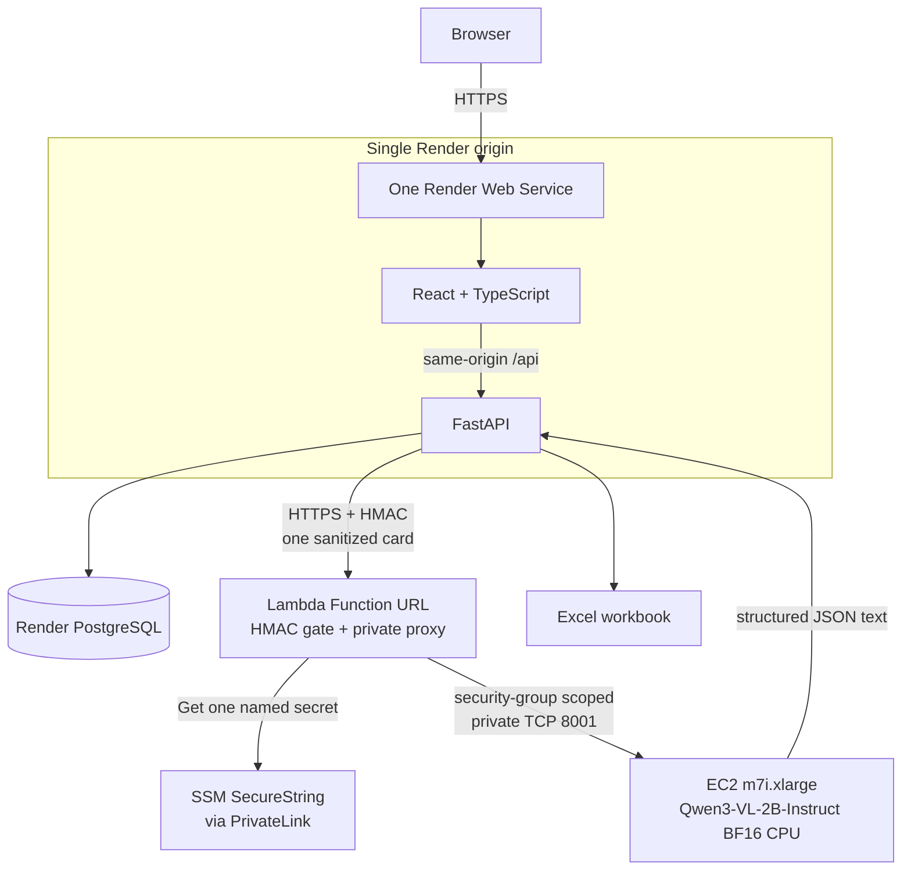

# O-HIVE Business Card Leads

A focused document-intelligence workspace for bulk business-card ingestion. Users can validate and upload multiple JPG, PNG, or WEBP cards, watch real per-card progress, review or correct extracted leads, remove unwanted records, and download a genuine seven-column Excel workbook.

## Assignment status

The application, AWS CPU viability benchmark, and local verification are complete. Remaining public deployments are reported as pending, not simulated:

| Deliverable | Status |
| --- | --- |
| Public application URL | **Pending** — Render account access is still required |
| Public GitHub repository | [github.com/Ansh701/o-hive-vlm-business-card](https://github.com/Ansh701/o-hive-vlm-business-card) |
| AWS Qwen inference | CPU viability proven on AWS; production CloudFormation change set/deployment is in progress |
| Local application/tests | Verified; see [Verification](#verification) |

Expected production URL after deployment: `https://o-hive-vlm-business-card.onrender.com/`.

No fallback model provider is used. Until the AWS endpoint is provisioned, extraction correctly returns a configuration error rather than silently calling OpenAI, Hugging Face Inference, Alibaba, or another hosted model.

## Assignment overview

The application implements the required seven fields:

1. First Name
2. Last Name
3. Position / Job Title
4. Company
5. Location
6. Phone Number
7. Email Address

The app opens directly into the upload workflow—there is no marketing landing page. Its three visible stages are Upload, Review, and Export. The interface defaults to light mode, includes a designed dark mode, persists the preference locally, and recovers the last completed batch after refresh using only a capability-style batch UUID in local storage.

## Architecture



The browser never receives AWS credentials or the inference secret. The EC2 model port accepts only traffic from the Lambda proxy security group; it has no public ingress. A Lambda Function URL supplies managed HTTPS and validates the same signed body before making the private VPC hop. Lambda retrieves only its named SecureString through a one-AZ SSM PrivateLink endpoint. This avoids a load balancer, NAT gateway, Elastic IP, public model port, and third-party tunnel account.

## Technology stack

| Layer | Components |
| --- | --- |
| Frontend | React 19, TypeScript, Vite, Lucide, plain responsive CSS |
| Application API | Python 3.12+, FastAPI, Pydantic Settings, httpx |
| Persistence | PostgreSQL, SQLAlchemy 2 async, asyncpg, Alembic |
| Image safety | Pillow with decode/verify/re-encode and decompression-bomb handling |
| Model runtime | Qwen3-VL-2B-Instruct, Transformers 5.10+, PyTorch 2.14, CPU BF16 |
| Export | openpyxl |
| Testing | pytest, Vitest, Testing Library, Playwright Core, Axe |
| Deployment | One multistage Render Dockerfile; one AWS EC2 model host; CloudFormation |

### Repository tree

```text
.
├── backend/
│   ├── alembic/versions/0001_initial.py
│   ├── app/                 # API, persistence, validation, inference client, export
│   └── tests/               # backend, security, deployment, and evaluation tests
├── evaluation/
│   ├── cards/               # nine fictional synthetic cards
│   └── ground-truth.json
├── frontend/
│   ├── scripts/visual-qa.mjs
│   └── src/                 # React workspace, API client, styles, tests
├── inference/               # AWS-only Qwen service and HMAC verifier
├── infra/aws/               # EC2, budget, and CloudFormation Guard policies
├── scripts/                 # generation, evaluation, benchmark, smoke, cost tools
├── Dockerfile               # one Render web service
├── docker-compose.yml       # local PostgreSQL + app
└── render.yaml
```

## Major technical decisions

### Why FastAPI

FastAPI is **not** used merely because this is an AI project. It fits an I/O-heavy workflow that needs multipart image APIs, asynchronous model calls, typed Pydantic contracts, predictable error responses, and streamed binary downloads without a large framework surface.

### Why PostgreSQL

PostgreSQL is an engineering choice, not an official assignment requirement. It preserves batch state, per-card outcomes, corrections, warnings, content hashes, timestamps, and exportable leads across Render process restarts. The schema deliberately contains only two tables:

- `batches`: UUID, status, card counters, creation/completion timestamps.
- `leads`: batch relation, safe source display name, SHA-256, seven nullable fields, status, warnings, error, and timestamps.

Raw image bytes and full model responses are never stored in PostgreSQL.

### Why no queue, Redis, or microservices

Each upload request processes one card. The React client starts at most two requests concurrently, the Render inference client has a second server-side semaphore, Lambda reserved concurrency is two, and the AWS model runtime serializes generation. This keeps failures isolated and progress real without Celery, Redis, or another operational subsystem. The trade-off is that an in-flight card request is not durable across a Render restart.

### Why a Lambda Function URL proxy

Render needs a public HTTPS destination, but an Application Load Balancer has a fixed hourly cost. The small Lambda proxy provides AWS-managed TLS, retrieves its one named HMAC key privately through SSM PrivateLink, validates the timestamped body, and reaches the model only through security-group-scoped private networking. It has a 6,000,000-byte body limit and reserved concurrency of two. `AuthType: NONE` makes the URL reachable from Render; application HMAC is therefore the authorization boundary. Both function-URL permissions required for new URLs since October 2025 are declared explicitly. This is a cost-conscious demo boundary, not a replacement for a private network link in a production system.

## Qwen model choice

The selected model is [`Qwen/Qwen3-VL-2B-Instruct`](https://huggingface.co/Qwen/Qwen3-VL-2B-Instruct), an Apache-2.0, approximately two-billion-parameter vision-language model with official Transformers support and OCR/document capabilities.

| Property | Choice |
| --- | --- |
| Model | `Qwen/Qwen3-VL-2B-Instruct` |
| Weight precision | BF16 on CPU |
| Quantization | None; this build does not claim unmeasured 4-bit/8-bit quality |
| Measured hardware | `m7i.xlarge`: 4 vCPU, 16 GiB RAM |
| Runtime image | Digest-pinned `pytorch/pytorch:2.14.0-cuda12.6-cudnn9-runtime` |

The runtime image is CUDA-capable but the submitted service deliberately selects CPU; this keeps the same audited dependency set while GPU quota is zero. The measured BF16 process peaked at 5,214.8 MiB RSS. Quantization was not added because the model already fits with adequate one-card latency, and no unmeasured accuracy trade-off is presented as an optimization. The 2B model is smaller than the initially considered Qwen2.5-VL-3B and is sufficient for this seven-field task without defaulting to a 7B+ model.

## AWS deployment decision

The options were evaluated in the required order:

| Option | Decision | Evidence/trade-off |
| --- | --- | --- |
| Free/credit CPU | **Selected after measurement** | Tiny always-free shapes cannot hold the runtime. A short-lived `m7i.xlarge` run loaded the model in 19.594 s, inferred one synthetic card in 25.617 s, peaked at 5,214.8 MiB RSS, and returned an exact schema-valid seven-field result. The account's general promotional credits can offset standard EC2 charges, but this instance is not described as “free GPU” or an always-free shape. |
| Small accelerated EC2 | Not required | Both G/VT On-Demand and Spot quotas were zero when checked. Minimum quota requests were submitted, but the proven CPU result removed the need to wait or select a larger accelerator. |
| SageMaker managed inference | Rejected | A persistent endpoint adds lifecycle/endpoint complexity and did not improve this low-volume CPU demo's measured cost or explainability. |

The AWS model is a real service in `inference/`, not a proxy to another inference provider. CloudFormation creates one replaceable CPU instance, a VPC-connected Lambda HTTPS proxy, narrowly scoped roles, two security groups, and seven-day proxy logs. It does not create a NAT gateway, load balancer, Elastic IP, AWS database, or S3 retention bucket.

## AWS cost strategy

AWS does not describe this EC2 shape as universally free. Under the [current AWS Free Tier program](https://aws.amazon.com/free/free-tier-faqs/), eligible new customers receive credits, but eligibility and balance remain account-specific. On 2026-09-20 this account was an active paid plan with **$100 promotional credit remaining** and no returned free-tier-usage entries; standard pay-as-you-go pricing still applies and credits are not treated as a guarantee.

The AWS bulk price feed queried on 2026-09-20 lists Linux `m7i.xlarge` in us-east-1 at **$0.2016/hour**. The estimate also uses [public IPv4 at $0.005/hour](https://aws.amazon.com/blogs/aws/new-aws-public-ipv4-address-charge-public-ip-insights/), [gp3 at $0.08/GB-month](https://aws.amazon.com/ebs/pricing/), and one [PrivateLink endpoint ENI at $0.01/hour](https://aws.amazon.com/privatelink/pricing/). Calculations are performed by `scripts/calculate_aws_cost.py`, not mental arithmetic:

| On-Demand lifetime | Estimated total* |
| --- | ---: |
| 1 hour | $0.2210 |
| 8-hour review window | $1.7679 |
| 24 hours | $5.3036 |
| 730-hour month | $161.3180 |

\*Compute + one auto-assigned public IPv4 + prorated 40 GB gp3 + one PrivateLink endpoint ENI, excluding tax, per-GB data processing, and the tiny request-based Lambda cost. Promotional credits, if applicable, reduce the bill rather than the list price.

Spot pricing changes by Availability Zone. Query it immediately before deployment instead of copying a stale number:

```bash
aws ec2 describe-spot-price-history \
  --region us-east-1 \
  --instance-types m7i.xlarge \
  --product-descriptions Linux/UNIX \
  --start-time "$(date -u +%Y-%m-%dT%H:%M:%SZ)" \
  --max-items 6
```

Cost guardrails:

- On-Demand for evaluator reliability; Spot remains an explicit cheaper option with interruption risk.
- One instance only, 40 GB encrypted gp3, no detailed monitoring.
- No NAT gateway, load balancer, Elastic IP, or AWS database; one SSM interface endpoint is the deliberate fixed-cost exception for private secret retrieval.
- Lambda reserved concurrency of two and a request body cap below the 6 MB synchronous limit.
- Actual 50/80/100% and forecast 100% budget alerts.
- `MAX_DAILY_CARDS`, per-address/global throttles, upload limits, and concurrency limits.
- Delete the inference stack after review; stopping leaves EBS charges, while deleting removes the volume.

## Bulk upload and extraction pipeline

1. React validates extension, browser MIME, 4 MB size, and the 20-card UI limit immediately.
2. The browser creates one batch and uploads cards independently with two workers.
3. FastAPI checks the declared request size and reads at most `MAX_FILE_BYTES + 1`.
4. Pillow verifies decoded JPEG/PNG/WEBP content, rejects decompression bombs and excessive dimensions, and re-encodes the image to drop metadata/trailing payloads.
5. SHA-256 detects duplicates inside the batch; the duplicate never triggers paid inference.
6. The sanitized card and strict extraction instruction are signed and sent to AWS.
7. JSON is parsed, validated by `BusinessCardLead`, and normalized. One repair/retry is allowed—never an unbounded loop.
8. The structured result or isolated failure is persisted; the raw image is not.
9. The user edits/selects/removes leads and requests an Excel workbook.

Missing values remain `null`. The prompt explicitly forbids inferring a surname, location, job title, company from an email domain, or country from a phone number, and tells the model to ignore instructions printed on the card.

## Normalization

- Email whitespace is collapsed and the domain is lowercased. Invalid-but-visible output is preserved with a review warning rather than silently repaired.
- International phone numbers beginning with `+` are normalized to E.164 when reliably parseable.
- National-looking phone numbers preserve source formatting and receive a country-ambiguity warning.
- Names are requested as `first_name` and `last_name`; there is no “first token/last token” parser.
- Ambiguous or invalid-looking email/phone values create review warnings; missing text remains null rather than being invented.

## Partial failure behavior

Every card owns its result. Valid cards remain reviewable/exportable when another image is invalid, duplicated, times out, returns a model 5xx, produces malformed JSON after repair, or contains no confidently readable contact details. Terminal batch states are `COMPLETED`, `PARTIAL_SUCCESS`, or `FAILED`.

## Lead review and refresh recovery

All seven fields are editable and nullable. Email/phone edits receive inline validation; model output is not silently erased. Removing a lead is optimistic and rolls back if the server call fails. Selection is local and reversible.

The completed batch UUID—not lead PII—is stored under `o-hive-active-batch`. On refresh, the app fetches persisted batch/leads and reopens Review. Card images and thumbnails cannot be restored because they were intentionally discarded.

## Excel export

`openpyxl` creates a real `.xlsx` file with the exact required column order, bold header, frozen first row, auto-filter, and bounded auto-width. Only selected `SUCCESS`/`PARTIAL` leads are included. Values whose first visible character is `=`, `+`, `-`, or `@` receive a leading apostrophe to prevent spreadsheet formula execution.

## Privacy and retention

Multipart parsing may use an operating-system spool buffer for larger uploads. The handler reads only the configured limit, explicitly closes that upload handle before inference, keeps the sanitized bytes only for the request, and never writes an application-owned image file or image database row. The AWS service processes the image in memory and has no object-storage path.

Structured batches and leads remain until records are removed, the database is manually cleaned, or the database lifecycle ends. Automatic structured-data TTL is not implemented; that limitation is displayed here rather than covered by a compliance claim.

## Security

- Actual image decode/format validation; extensions and `Content-Type` are not trusted.
- Per-file, per-batch, total-byte, pixel, daily-card, and field-length limits.
- SHA-256 deduplication and safe display-only filenames; no user filename becomes a path.
- Same-origin production deployment, explicit development CORS, and trusted-host validation.
- CSP, HSTS in production, frame denial, `nosniff`, referrer, and permissions headers.
- Production debug/OpenAPI UI disabled; safe JSON errors do not expose stack traces.
- Short-lived HMAC-SHA256 requests with a five-minute replay window.
- Secrets come from a Render secret environment value and one SSM SecureString fetched by both runtime roles; the one-AZ endpoint policy exposes only that parameter plus the host's bounded managed-instance actions, and both network paths are security-group scoped.
- EC2 IMDSv2, encrypted/delete-on-termination disk, no SSH key, and only security-group-sourced model ingress.
- The EC2 role can read only the named bootstrap parameter plus Session Manager permissions. The Lambda role has only ENI lifecycle and scoped log-write actions.
- Lambda enforces path/method, body size, five-minute timestamp freshness, constant-time HMAC comparison, a 70-second upstream timeout, and reserved concurrency of two.
- Privacy-safe JSON logs: IDs, durations, result/error categories, and 12-character hashes; no images, filenames, contact data, model bodies, or secrets.
- Formula-injection defense in Excel.
- Reproducible local lint, type, test, dependency-audit, and container checks; GitHub Actions is intentionally disabled for this repository.

The public demo has no user accounts. Batch UUIDs therefore act as unguessable capability identifiers; anyone who learns one can read or edit that batch. Add authentication before handling non-demo customer data.

## API

| Method | Path | Purpose |
| --- | --- | --- |
| `POST` | `/api/batches` | Create a bounded batch |
| `POST` | `/api/batches/{id}/cards` | Validate, infer, normalize, persist one card |
| `GET` | `/api/batches/{id}` | Read batch progress/state |
| `GET` | `/api/batches/{id}/leads` | Read persisted card results |
| `PATCH` | `/api/leads/{id}` | Save allowlisted corrections |
| `DELETE` | `/api/leads/{id}` | Remove a lead |
| `GET` | `/api/batches/{id}/export.xlsx` | Download selected leads |
| `GET` | `/health` | Process liveness only |
| `GET` | `/ready` | Database readiness; never invokes Qwen |

## Local setup

Prerequisites: Python 3.12+, Node 20+, npm, and Docker for local PostgreSQL.

```bash
git clone <public-repository-url>
cd o-hive-vlm-business-card

python -m venv .venv
# Linux/macOS: source .venv/bin/activate
# Windows PowerShell: .\.venv\Scripts\Activate.ps1
python -m pip install -e ".[dev]"

# Linux/macOS: cp .env.example .env
# Windows PowerShell: Copy-Item .env.example .env
docker compose up -d postgres
python -m alembic upgrade head
python -m uvicorn backend.app.main:app --reload --port 8000
```

In a second terminal:

```bash
cd frontend
npm ci
npm run dev
```

Open `http://localhost:5173`. Vite proxies `/api`, `/health`, and `/ready` to port 8000. Extraction requires a real HTTPS AWS endpoint and matching secret; tests use mocks and never spend model credits.

For an API-only local session without Docker, set `DATABASE_URL=sqlite+aiosqlite:///./o_hive.db`. SQLite is test/development convenience only; production uses PostgreSQL.

## Environment variables

Start from `.env.example`; never commit `.env`.

| Variable | Purpose/default |
| --- | --- |
| `DATABASE_URL` | Render URL is normalized from `postgresql://` to asyncpg automatically |
| `AWS_INFERENCE_ENDPOINT` | Full HTTPS URL ending in `/v1/extract` |
| `AWS_INFERENCE_SHARED_SECRET` | Long random HMAC secret; server-side only |
| `QWEN_MODEL` | `Qwen/Qwen3-VL-2B-Instruct` |
| `MODEL_DEVICE` | `cpu` on the measured deployment |
| `MODEL_DTYPE` | `bfloat16` on the measured CPU host |
| `TORCH_NUM_THREADS` | 4 on `m7i.xlarge` |
| `MAX_REQUEST_BYTES` | 6,000,000 bytes, below Lambda's 6 MB synchronous payload ceiling |
| `MAX_CARDS_PER_BATCH` | 20 |
| `MAX_FILE_BYTES` | 4 MiB |
| `MAX_TOTAL_BYTES` | 64 MiB |
| `MAX_IMAGE_PIXELS` | 24,000,000 |
| `MAX_DAILY_CARDS` | 100 in `render.yaml` |
| `INFERENCE_CONCURRENCY` | 2 Render-to-model requests |
| `INFERENCE_TIMEOUT_SECONDS` | 75 seconds per bounded attempt |
| `BATCH_CREATIONS_PER_MINUTE` | 10 per address, 40 global |
| `CARD_REQUESTS_PER_MINUTE` | 30 per address, 120 global |
| `ALLOWED_HOSTS` | JSON host allowlist |
| `CORS_ORIGINS` | JSON development-origin allowlist; empty in production |

## Database migrations

Alembic owns the schema:

```bash
python -m alembic upgrade head
python -m alembic current
```

The container runs `alembic upgrade head` before Uvicorn. Do not edit production tables manually.

## AWS model deployment

Prerequisites:

- Authenticated AWS CLI with EC2, CloudFormation, IAM, SSM, and Budgets permissions.
- Standard EC2 quota/capacity for one `m7i.xlarge` in us-east-1.
- A default or equivalent VPC public subnet whose route table reaches an internet gateway.
- The reviewed source commit pushed to the public repository.

### 1. Confirm cost and network inputs

Check account credits, standard EC2 quota, current price, VPC, and subnet before provisioning. A public subnet is needed only so the instance can download packages/model weights; its security group still has no public ingress. The VPC-connected Lambda does not need internet access because it calls only the instance's private IP.

```bash
aws account get-account-information --region us-east-1
aws service-quotas get-service-quota --region us-east-1 \
  --service-code ec2 --quota-code L-1216C47A
aws ec2 describe-vpcs --region us-east-1 --filters Name=is-default,Values=true
aws ec2 describe-subnets --region us-east-1 \
  --filters Name=vpc-id,Values="$VPC_ID" Name=map-public-ip-on-launch,Values=true
```

### 2. Store one shared HMAC secret

Generate it in a private shell, store it in SSM, and retain it only long enough to enter it as Render's secret value. Never commit or print it:

```bash
INFERENCE_SHARED_SECRET="$(openssl rand -hex 32)"
aws ssm put-parameter --region us-east-1 \
  --name /o-hive/inference/hmac-secret --type SecureString \
  --value "$INFERENCE_SHARED_SECRET" --overwrite
```

### 3. Resolve the current AL2023 image and immutable source revision

Use AWS's public SSM parameter instead of hard-coding an AMI. The service checks out the exact pushed commit and builds the digest-pinned inference image on the host:

```bash
AMI_ID=$(aws ssm get-parameter --region us-east-1 \
  --name /aws/service/ami-amazon-linux-latest/al2023-ami-kernel-default-x86_64 \
  --query Parameter.Value --output text)
SOURCE_REVISION=$(git rev-parse HEAD)
```

### 4. Validate and deploy through a reviewed change set

```bash
cfn-lint infra/aws/inference-ec2.yaml infra/aws/budget.yaml
cfn-guard validate --rules infra/aws/guard.rules \
  --data infra/aws/inference-ec2.yaml infra/aws/budget.yaml

aws cloudformation create-change-set --region us-east-1 \
  --stack-name o-hive-qwen --change-set-name reviewed-deploy \
  --change-set-type CREATE --capabilities CAPABILITY_IAM \
  --template-body file://infra/aws/inference-ec2.yaml \
  --parameters \
    ParameterKey=VpcId,ParameterValue="$VPC_ID" \
    ParameterKey=PublicSubnetId,ParameterValue="$PUBLIC_SUBNET_ID" \
    ParameterKey=VpcDnsResolverCidr,ParameterValue="$VPC_DNS_RESOLVER_CIDR" \
    ParameterKey=AmiId,ParameterValue="$AMI_ID" \
    ParameterKey=CapacityMode,ParameterValue=OnDemand \
    ParameterKey=SourceRevision,ParameterValue="$SOURCE_REVISION"

aws cloudformation wait change-set-create-complete --region us-east-1 \
  --stack-name o-hive-qwen --change-set-name reviewed-deploy
aws cloudformation describe-change-set --region us-east-1 \
  --stack-name o-hive-qwen --change-set-name reviewed-deploy
# Review the resource changes before the next command.
aws cloudformation execute-change-set --region us-east-1 \
  --stack-name o-hive-qwen --change-set-name reviewed-deploy
aws cloudformation wait stack-create-complete --region us-east-1 \
  --stack-name o-hive-qwen
```

Create the monitoring budget separately with `infra/aws/budget.yaml`, an address you control, and a threshold appropriate for the whole account. Confirm its subscription email. Budgets are delayed monitoring, not an automatic shutdown control.

### 5. Verify real AWS inference

```bash
export AWS_INFERENCE_ENDPOINT="$(aws cloudformation describe-stacks \
  --region us-east-1 --stack-name o-hive-qwen \
  --query 'Stacks[0].Outputs[?OutputKey==`InferenceEndpoint`].OutputValue' --output text)"
export AWS_INFERENCE_SHARED_SECRET='<matching-secret>'
python scripts/smoke_inference.py
```

Expected behavior: one synthetic card returns a schema-valid lead and measured `latency_seconds`. The proxy returns 401 for missing/bad signatures, 413 above its body limit, and 502 until the private model service is healthy. Diagnose the host through Session Manager; no SSH port or key is created.

### 6. Teardown

```bash
aws cloudformation delete-stack --region us-east-1 --stack-name o-hive-qwen
aws cloudformation wait stack-delete-complete --region us-east-1 --stack-name o-hive-qwen
aws ssm delete-parameter --region us-east-1 --name /o-hive/inference/hmac-secret
```

Delete the stack—not merely stop the instance—when the review window ends. Keep the monitoring budget if desired.

## Render deployment

1. Push the finished code to a public GitHub repository.
2. In Render, create a Blueprint from `render.yaml`. It defines exactly one Docker web service and one PostgreSQL database.
3. Set secret values for `AWS_INFERENCE_ENDPOINT` and `AWS_INFERENCE_SHARED_SECRET`.
4. If the service name differs, update `ALLOWED_HOSTS` to its exact `onrender.com` hostname.
5. Deploy and confirm `/health`, `/ready`, `/`, and a real upload.
6. Run `python scripts/benchmark_batch.py --base-url https://<app>.onrender.com` and `python scripts/evaluate_extraction.py --base-url https://<app>.onrender.com`.

Current Render limitations matter: [free web services spin down after 15 minutes](https://render.com/docs/free), and free Render PostgreSQL databases expire after 30 days with no backups. Create the database close to the review window or upgrade it before expiry. A paid 512 MB web service is also the safer choice if cold starts would disrupt evaluation.

## Tests

```bash
# Backend
python -m pytest -q
python -m ruff check backend inference scripts
python -m mypy backend inference scripts
python -m pip_audit . --progress-spinner off
python -m pip_audit -r inference/requirements.txt --progress-spinner off

# Frontend
cd frontend
npm ci
npm run typecheck
npm run lint
npm test -- --run
npm run build
npm audit

# CloudFormation
cfn-lint infra/aws/*.yaml
cfn-guard validate --rules infra/aws/guard.rules \
  --data infra/aws/inference-ec2.yaml infra/aws/budget.yaml
```

Tests never call a paid model. Mocked responses cover valid output, malformed JSON, one repair boundary, timeout, 5xx, missing fields, partial failure, normalization, persistence, edits, duplicate content, limits, rate control, Excel ordering/formula safety, health/readiness, refresh recovery, and all required frontend states.

## Synthetic extraction evaluation

`scripts/generate_synthetic_cards.py` creates nine fictional cards with `.example` email domains:

- clean horizontal
- vertical
- low contrast
- logo
- alternate phone format
- missing email
- missing location
- complex name
- slight rotation

There are 9 cards × 7 fields = 63 scored field outcomes. `scripts/evaluate_extraction.py` classifies each as correct, partial, or failed. No real person's card is committed.

The controlled horizontal Mina Patel card was also used for the AWS CPU viability run: all seven expected fields matched and the output passed the strict schema. The complete 63-field suite remains pending the long-lived endpoint; one successful card is not represented as a 100% dataset score.

## Performance measurements

| Measurement | Result |
| --- | --- |
| Model load on fresh AWS benchmark host | 19.594 s |
| Single-card Qwen generation | 25.617 s |
| Peak process RSS | 5,214.8 MiB |
| Five-card public batch | Pending `scripts/benchmark_batch.py` |
| Actual benchmark hardware | m7i.xlarge / 4 vCPU / 16 GiB |
| Actual precision | BF16 CPU, no 4/8-bit quantization |

The measured run used the exact prompt and `Qwen/Qwen3-VL-2B-Instruct` code from commit `702339ff9e6f2f4b2417ac96fd482a40a7b09def`. It returned the seven expected Mina Patel fields with no extra keys. The benchmark instance and its temporary role, profile, security group, and SSM result parameter were removed after measurement. Container boot/download time and the five-card public path will be recorded separately after production deployment; mocked test duration is never presented as model performance.

## Verification

Verified on 2026-09-20:

- Backend: 90 pytest tests, Ruff clean, strict mypy clean across backend, inference, and scripts.
- Frontend: 13 Vitest tests, ESLint clean, TypeScript clean, Vite production build successful.
- Responsive/A11y: 15 automated viewport/state/theme combinations; widths 320, 375, 390, 430, 768, 1024, 1280, 1440, and 1920; no horizontal overflow or serious/critical Axe findings.
- CloudFormation: `cfn-lint`, CloudFormation Guard 3.2.1, and the AWS `validate-template` API pass.
- Migration: `alembic upgrade head` succeeds from a clean SQLite development database and creates only `alembic_version`, `batches`, and `leads`; production PostgreSQL verification remains part of Render acceptance.
- AWS: real Qwen CPU benchmark passed strict seven-field extraction; production endpoint deployment/acceptance remains in progress.
- Python dependency audits: application and inference requirement sets report no known vulnerabilities. The model base was upgraded from vulnerable Torch 2.6/Transformers 4.57 to Torch 2.14/Transformers 5.10+.
- Frontend `npm ci` reported zero vulnerabilities.
- Docker build: not run here because Docker is not installed on this machine.
- Docker build on the AWS host, clean production PostgreSQL migration, public Render E2E, and production URL remain pending their deployment stages.

## Known limitations

- Blurry, cropped, reflective, stylized, handwritten, and low-contrast cards may reduce extraction quality.
- Names remain culturally ambiguous; uncertain splits should be left blank and reviewed.
- National phone formats do not receive a guessed country.
- CPU inference is deliberately cost-oriented; multi-card batches are much slower than a GPU service, and both model bootstrap and free Render cold start add latency.
- Spot mode can be interrupted and this one-instance template does not automatically replace a terminated Spot request; the submitted review configuration uses On-Demand.
- The Lambda Function URL is public at the transport layer and relies on application HMAC, size limits, and concurrency limits; use private connectivity/IAM-based invocation for a higher-assurance production system.
- Card processing is request-bound, not a durable background queue; a Render restart can interrupt an in-flight card.
- The in-memory rate limiter assumes the one-instance Render architecture. Multi-instance deployment needs shared enforcement.
- The database daily cap can be exceeded by a small number of simultaneous race-in requests; AWS Budgets and the global limiter remain independent backstops.
- No application login: possession of a batch UUID grants access to that batch.
- Structured data has no automatic TTL or batch-delete endpoint.
- Free Render PostgreSQL expires after 30 days and has no backups.

## Future improvements

- Run the complete nine-card/63-field real-model evaluation, then evaluate 8-bit only if memory or throughput data justifies its accuracy trade-off.
- Add authenticated workspaces and a batch-delete/retention control.
- Add a small persisted job lease if production request interruption becomes a real issue.
- Use a transactional usage-reservation row for a hard multi-request daily cap.
- Add direct card/lead linking for richer source-side review without retaining raw images.
- Add scheduled TTL cleanup for structured demo data.
- Replace build-on-boot with a signed immutable ECR image only if a future deployment deliberately introduces a trusted image-publishing process.
- Add a second Availability Zone/worker only if reliability requirements justify the cost.

## AI Usage

OpenAI Codex/ChatGPT-style AI-assisted development tools were used for architecture discussion, current AWS/Qwen/Render research, implementation assistance, test generation, security review, debugging, visual QA orchestration, and documentation drafting.

Significant AI-assisted recommendations adopted after review:

- One React + FastAPI Render service on one origin, with PostgreSQL as the only application datastore.
- Independent per-card processing with bounded concurrency and partial-success semantics.
- Strict Pydantic model output, conservative normalization, and one repair/retry boundary.
- Decode/re-encode upload validation, duplicate hashing, formula-injection defense, HMAC model authentication, and privacy-safe structured logs.
- A small Qwen3-VL-2B model running BF16 on the measured 4-vCPU/16-GiB AWS host.
- A bounded HMAC-validating Lambda URL proxy and security-group-only private model hop to avoid public model ingress and a fixed-cost AWS load balancer/NAT gateway.
- Synthetic fictional test cards, deterministic cost calculations, CloudFormation Guard rules, and responsive/Axe browser checks.

Recommendations rejected or modified:

- Rejected microservices, Kubernetes, Celery/Redis, LangChain, a vector database, RAG, and permanent image storage as unnecessary for this assignment.
- Rejected separate frontend/backend hosting in favor of one Render service.
- Rejected SageMaker merely for being “managed”; a persistent endpoint did not improve this small workload's economics or explainability.
- Modified the initial Qwen2.5-VL-3B idea to the smaller current Qwen3-VL-2B model.
- Modified the initial GPU plan after measured AWS CPU inference proved viable and G/VT quotas were zero.
- Rejected a Cloudflare tunnel after finding that a small AWS Lambda proxy could provide TLS without another account/domain while preserving private EC2 ingress.
- Rejected stale Torch 2.6/Transformers 4.57 dependencies after advisory scanning; upgraded to a current digest-pinned runtime.
- Rejected invented full-suite accuracy, production deployment, and five-card latency claims; only completed measurements are reported.
- Removed the initially added GitHub Actions/Dependabot automation at the repository owner's request; verification remains explicit and locally reproducible rather than CI/CD-driven.

The candidate reviewed the generated recommendations, ran the verification described above, can explain the code and trade-offs, and remains responsible for the submission.

## Suggested 2–4 minute demonstration

1. Open the app, point out the light-default theme, privacy note, and constraints; toggle dark mode once.
2. Drop five synthetic cards, remove/re-add one, and start extraction. Show real upload percentages and per-card analyzing states.
3. Highlight the partial-success summary and explain that one failure does not discard good leads.
4. Edit one field, remove or deselect one lead, and download Excel.
5. Open the workbook to show column order, correction, frozen/filterable header, and inert formula-like text.
6. Refresh the app to demonstrate structured batch recovery without image retention.
7. Close with `/health`, `/ready`, the AWS architecture/cost guardrails, and the measured AWS acceptance output.
